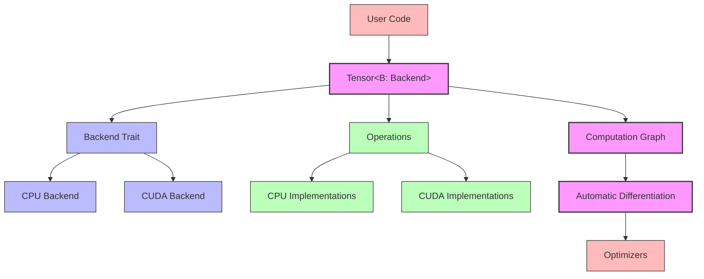
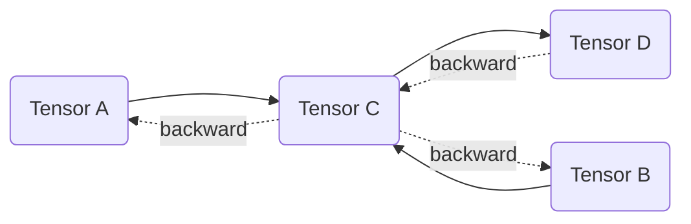

# RustTensor Library Architecture

This document provides an overview of the Rust Tensor Library's architecture, explaining the key components, their relationships, and design decisions.

## Table of Contents

1. [High-Level Architecture](#high-level-architecture)
2. [Core Components](#core-components)
3. [Backend System](#backend-system)
4. [Automatic Differentiation](#automatic-differentiation)
5. [Hooks System](#hooks-system)
6. [Operations System](#operations-system)
7. [Operator Overloading](#operator-overloading)
8. [Optimizers](#optimizers)
9. [Feature Flags](#feature-flags)
10. [Design Decisions](#design-decisions)

## High-Level Architecture

The RustTensor Library is designed around a modular architecture with several key components:



## Core Components

### Tensor

The `Tensor<B: Backend>` struct is the central type in the library:

- **Generic over Backend**: Uses a type parameter `B` that implements the `Backend` trait
- **Data Storage**: Contains data in backend-specific storage format
- **Gradient Tracking**: Optional gradient storage for automatic differentiation
- **Computation Graph**: Tracks operations for backward pass
- **Device Information**: Tracks where the tensor data resides (CPU/CUDA)

```rust
pub struct Tensor<B: Backend> {
    data: Rc<RefCell<TensorData<B>>>,
    _marker: PhantomData<B>,
}

pub struct TensorData<B: Backend> {
    pub id: usize,
    pub data: B::Storage,
    pub grad: Option<B::Storage>,
    pub requires_grad: bool,
    pub op: Option<Op<B>>,
    pub device: Device,
    pub hooks: Vec<Box<dyn Hook<B>>>,
}
```

### Type Aliases

For convenience, the library provides type aliases for common backend configurations:

```rust
pub type CpuTensor = Tensor<CpuBackend>;
pub type CudaTensor = Tensor<CudaBackend>;
```

## Backend System

The `Backend` trait defines the interface that all backends must implement:

```rust
pub trait Backend: 'static + Sized {
    type Storage: 'static;
    
    // Creation methods
    fn zeros(shape: &[usize]) -> Result<Self::Storage, Error>;
    fn ones(shape: &[usize]) -> Result<Self::Storage, Error>;
    fn from_array(array: Array) -> Result<Self::Storage, Error>;
    
    // Data access methods
    fn shape(tensor: &Self::Storage) -> &[usize];
    fn copy_to_host(tensor: &Self::Storage) -> Result<Vec<f32>, Error>;
    
    // Operations
    fn add(a: &Self::Storage, b: &Self::Storage) -> Result<Self::Storage, Error>;
    fn sub(a: &Self::Storage, b: &Self::Storage) -> Result<Self::Storage, Error>;
    fn mul(a: &Self::Storage, b: &Self::Storage) -> Result<Self::Storage, Error>;
    // ... many more operations
}
```

### CPU Backend

The `CpuBackend` implements the `Backend` trait using `ndarray` for storage and computations:

- **Storage Type**: `Array` (a wrapper around `ndarray::Array`)
- **Performance**: Can use system BLAS libraries via the `cpu_openblas` feature
- **Implementation**: Uses vectorized operations where possible

### CUDA Backend

The `CudaBackend` implements the `Backend` trait using CUDA for GPU acceleration:

- **Storage Type**: Custom CUDA memory management
- **Kernels**: Custom CUDA kernels for operations
- **cuBLAS Integration**: Uses cuBLAS for matrix operations
- **Context Management**: Thread-safe CUDA context handling

## Automatic Differentiation

The library uses dynamic automatic differentiation (autograd):

- **Computation Graph**: Built dynamically during forward pass
- **Reverse-Mode Differentiation**: Computes gradients efficiently
- **Operation Tracking**: Each operation records its inputs and a closure for backward pass
- **Gradient Accumulation**: Handles multiple paths to the same node*



## Hooks System

The hooks system provides a mechanism to monitor and modify tensor operations during both forward and backward passes:

- **Forward Hooks**: Executed after a tensor operation is performed
- **Backward Hooks**: Executed when gradients flow through a tensor during the backward pass
- **Hook Registration**: Hooks are registered with tensors and return a unique ID for later removal
- **Hook Interface**: All hooks implement the `Hook` trait

```rust
pub trait Hook<B: Backend>: Debug {
    fn forward(&self, tensor: &Tensor<B>, input: &[&Tensor<B>], output: &Tensor<B>) -> Result<(), Error>;
    fn backward(&self, tensor: &Tensor<B>, grad_input: &[Option<Tensor<B>>], grad_output: &Tensor<B>) -> Result<(), Error>;
}
```

### Hook Types

1. **FnHook**: A convenience wrapper around closures for quick hook creation
2. **Custom Hook Types**: Users can implement the `Hook` trait for custom behavior

### Use Cases

- **Debugging**: Monitoring intermediate values during forward and backward passes
- **Gradient Clipping**: Modifying gradients to prevent exploding gradients
- **Feature Visualization**: Capturing activations in neural networks
- **Custom Regularization**: Applying custom regularization during the backward pass

## Operator Overloading

The library provides operator overloading for tensors, allowing for more expressive and readable code:

- **Arithmetic Operators**: `+`, `-`, `*`, `/` for element-wise operations
- **Comparison Operators**: `==`, `!=` for tensor equality checks

Operator overloading is implemented for references to tensors to avoid unnecessary moves and clones:

```rust
// Implementation for &Tensor + &Tensor
impl<'a, 'b, B: Backend> Add<&'b Tensor<B>> for &'a Tensor<B> {
    type Output = Result<Tensor<B>, Error>;
    
    fn add(self, other: &'b Tensor<B>) -> Self::Output {
        ops::add(self, other)
    }
}

// Implementation for &Tensor * f32 (scalar multiplication)
impl<'a, B: Backend> Mul<f32> for &'a Tensor<B> {
    type Output = Result<Tensor<B>, Error>;
    
    fn mul(self, scalar: f32) -> Self::Output {
        ops::mul_scalar(self, scalar)
    }
}
```

### Error Handling with Operators

Operator overloading in Rust doesn't support returning `Result` types directly, so the library uses a pattern where operators return `Result<Tensor<B>, Error>` which must be unwrapped:

```rust
// Using operator overloading with error handling
let c = (&a + &b)?; // Note the ? operator to handle potential errors

// Chaining operations
let result = (&a + &b)?.relu()?;
```

### Benefits of Operator Overloading

1. **Readability**: Mathematical expressions look more natural
2. **Expressiveness**: Complex operations can be written concisely
3. **Familiarity**: Similar to Python's tensor libraries (PyTorch, NumPy)

### Implementation Details

- All operators delegate to the corresponding functions in the `ops` module
- Operators are implemented for references to avoid unnecessary cloning
- Both tensor-tensor and tensor-scalar operations are supported
- Broadcasting is handled automatically by the underlying operations

## Operations System

Operations are implemented in a backend-agnostic way:

- **Public API**: Functions in the `ops` module that work with any backend
- **Backend-Specific Implementation**: Each operation delegates to the backend
- **Gradient Registration**: Operations register their backward pass during forward computation
- **Broadcasting**: Automatic shape broadcasting for compatible operations

### Operation Categories

1. **Element-wise Operations**: Add, Subtract, Multiply, Divide, etc.
2. **Matrix Operations**: MatMul, Transpose
3. **Activation Functions**: ReLU, Sigmoid, Tanh, etc.
4. **Reduction Operations**: Sum, Mean, Max, etc.
5. **Shape Operations**: View, Expand, Squeeze, etc.
6. **Neural Network Operations**: Conv2D, MaxPool2D, etc.

## Optimizers

The library provides several optimizers for neural network training:

- **SGD**: Basic stochastic gradient descent
- **MomentumSGD**: SGD with momentum
- **Adam**: Adaptive moment estimation
- **Adagrad**: Adaptive gradient algorithm

All optimizers follow a common interface:

```rust
pub trait Optimizer<B: Backend> {
    fn step(&mut self) -> Result<(), Error>;
    fn zero_grad(&mut self) -> Result<(), Error>;
}
```

## Feature Flags

The library uses feature flags to control optional functionality:

- **`cuda`**: Enables CUDA GPU support
- **`serialization`**: Enables tensor serialization
- **`mnist`**: Enables MNIST dataset loading utilities
- **`debug_logs`**: Enables detailed diagnostic logging
- **`cpu_openblas`**: Enables OpenBLAS acceleration for CPU operations

## Design Decisions

### 1. Generic Backend System

The library uses a trait-based approach for backends, allowing:
- Code reuse between backends
- Easy addition of new backends
- Backend-agnostic user code

### 2. Dynamic Computation Graph

Unlike static frameworks (e.g., TensorFlow 1.x), the library builds the computation graph dynamically:
- More flexible for research and experimentation
- Easier debugging
- More Pythonic/intuitive API

### 3. Reference Counting and Interior Mutability

The library uses `Rc<RefCell<TensorData>>` for tensor data:
- Allows multiple tensors to share the same data
- Enables in-place operations when possible
- Supports efficient view operations without copying data

### 4. Safety Considerations

- Internal mutation is controlled via `RefCell`
- Graph consistency is maintained via careful operation tracking
- Mutable operations are marked with warning comments
- Error handling uses `Result` throughout the codebase

### 5. Performance Optimizations

- Custom CUDA kernels for critical operations
- cuBLAS integration for matrix operations
- Optional OpenBLAS integration for CPU
- Efficient memory management and reuse

## Implementation Details

### Memory Management

- **CPU Backend**: Uses Rust's memory management via `ndarray`
- **CUDA Backend**: Custom CUDA memory allocation and deallocation
- **View Operations**: Create new tensors that share underlying storage
- **In-place Operations**: Modify tensor data in-place when possible

### Error Handling

- **Result Type**: Operations return `Result<T, Error>` for robust error handling
- **Error Types**: Specific error variants for different failure modes
- **Error Propagation**: Uses the `?` operator throughout the codebase

### Thread Safety

- **CPU Backend**: Thread-safe via Rust's ownership system
- **CUDA Backend**: Thread-safe via CUDA context management
- **Note**: The library is not designed for concurrent modification of the same tensor from multiple threads
